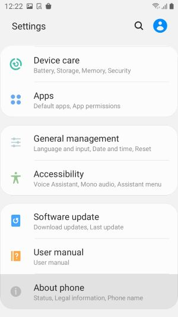
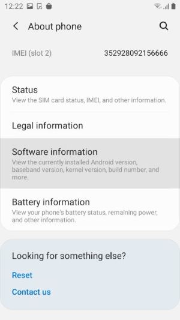
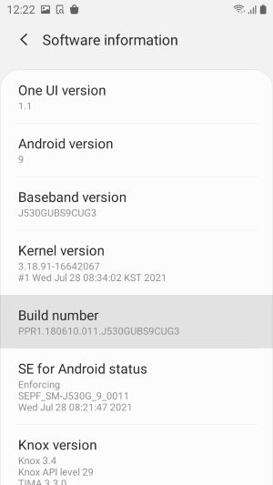
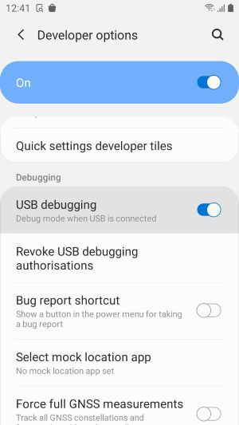
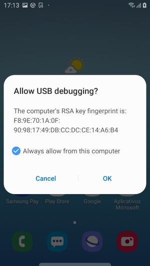

!!! quote "Enable Developer Mode on your Android device to allow Ansight features."

For Ansight to be able to capture an Android device logs from `logcat` and record the screen, it is required to enable developer mode on your target device.

!!! Tip "Important"
    The device used to illustrate this procedure is an _Samsung Galaxy J5 Pro_, which employs custom interface and Settings screen, but the general procedure is mostly the same for any Android device. If you're having issues finding the screens about check for a vendor specific procedure on your brands support site.

!!! warning
    When you enable Developer Mode on your Android device, several advanced features of the operating system are enabled, such as side-loading of apps. This may allow your device for installation of unwanted apps, so its important to be warned if you're using a personal device. The recommendation is always to use a device specific for testing or disable developer mode when Ansight (or other development features) is not in use.

The procedure to enable Developer Mode is:

* Open the **Settings** app on your device and lookup for the **About your Phone** option.

{: style="width: 300px;"}

* Depending on your iPhone, what we're looking for may be on the **Software Information** page, or this section may be merged into this about page. Select the option if it have one.

{: style="width: 300px;"}

{: style="width: 300px" }

* Look up for the `About` option
* Under the About Screen search for the `Build Number`
* Tap 7 times on the Build Number option, you should receive a message such as `You are now a developer`

After following those steps the Developer Options menu item should appear on the Settings page. An additional step is to enable the **USB Debugging** option. This is what allows you computer to connect to a device and collect information that will feed Ansight session data. To allow this option you should:

* Open the `Developer Options` option on the `Settings` screen
* Look up for the `Debugging` section
* Find the `USB debugging` option and enable the Switch

After enabling the USB debugging you should connect the device that you want to record sessions on Ansight. A dialog should be presented asking you to Allow USB debugging.

You're all set to start using Ansight.
